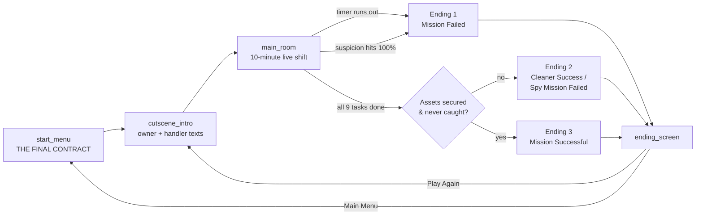

# The Cleaner

A first-person, timed cleaning-and-infiltration game built in **Godot 4.7.2** (GDScript, Forward+ renderer). Everything in the scene — walls, furniture, lights, the bookshelf, every task prop — is generated procedurally from code, so the project has **no external 3D asset dependencies** and opens/runs from a clean clone with nothing to import.

---

## Story

Lucas is a cleaner. A wealthy homeowner hires him for a routine job:

> **Owner:** "I'll be back in six hours. Please get this place cleaned up — I'll pay you well for it."
> **Lucas:** "Yes, don't worry. All of it will be done."

Five hours pass. Lucas is most of the way through the house when his phone buzzes.

> **Owner (text):** "Almost done for the day — I'll be home in 10 mins."

Then a second message arrives — from someone else entirely.

> **Unknown (text):** "You have less time than expected. Collect the DIAMOND, PEN DRIVE, and FILES before you leave."

Lucas isn't just a cleaner. Somebody is running him. He now has **10 minutes** to look like an ordinary guy finishing an ordinary cleaning job — while quietly locating and taking the things he was actually sent in for.

Along the way, scrubbing a stain out of the carpet turns up something the job description didn't mention:

> *"This carpet fiber has been burnt by chemical industrial solvent. Someone was scrubbing blood out of this floor long before you arrived..."*

Whatever this house is, Lucas is not the first person to have a secret reason for being in it. What he finishes, what he takes, and whether anyone notices him doing it — decides how the night ends.

## The Twist: You're a Spy in a Cleaner's Uniform

The house believes you're here to clean. Your actual handler wants two things out of the house:

- The **diamond**, locked in a desk chest in the back corner (behind the cabinet, needs a key hidden somewhere in the bathroom).
- The **pen drive**, hidden in a secret drawer built into the wall — behind a lock you have to pick yourself, by hand, with a timing-based minigame.

Every real cleaning task you do is also **cover**. Every bit of snooping — jimmying a lock, opening the chest, lingering too long in one spot — raises your **suspicion**. Get caught, and the night ends badly even if the house is spotless.

## Mission Objective

You have **10 minutes**. In any order:

| Task | What it is |
|---|---|
| **Dusting** (x6) | Wipe down 6 dust spots around the room |
| **Rewire Panel** | Fix the electrical panel — match the colored wire pairs before it's repaired |
| **Fridge** | Carry the fridge to its marked spot on the left wall, then flip the wall switch |
| **Furniture** (x5) | Move the sofa, dining table, two chairs and the cabinet onto their marked footprints |
| **Washroom** (x3) | Clean the bathroom mirror, the bathroom door, and the plumbing pipe |
| **Lock-Pick Drawer** | Pick the hidden wall drawer's lock — grants the **Pendrive** |
| **Straighten Picture** | Straighten a crooked picture frame — also reveals a scratched 4-digit code for a hidden wall safe |
| **Scrub Spill** | Clean up a liquid spill on the floor |
| **Old Stain** | Scrub the "permanent" stain — it never fully disappears, but it's the story clue above |

Plus one fully optional side-puzzle: a **hidden wall safe**, opened with the code revealed by the crooked-picture task. It doesn't affect winning or losing — it's there for players who go looking.

And the one real choice: find the desk key, get past the cabinet, unlock the chest, and decide — **STEAL THE DIAMOND** or **LEAVE THE DIAMOND**.

## Controls

| Input | Action |
|---|---|
| **WASD** | Move |
| **Mouse** | Look around |
| **Hold E** | Interact / clean (release to stop) |
| **1 / 2 / 3** | Switch equipment: Electrical Kit / Mop / Bathroom Scrubber |
| **Space** | Open / close the bathroom door (while looking at it) |
| **Esc** | Pause / resume (releases the mouse cursor) |
| **Left Click** | Re-capture the mouse cursor |

### Equipment gating

Some interactions require the right tool equipped first — matching a real cleaner's kit:

| Equipment | Required for |
|---|---|
| **Electrical Kit** (1) | Rewire panel, fridge/power switches |
| **Mop** (2) | Dust, spills, the old stain, spider webs — also gives you "cover" (reduced suspicion gain) while equipped |
| **Bathroom Scrubber** (3) | Bathroom mirror, bathroom door, bathroom pipe |

Furniture, lock-picking, the picture, the safe, and pickups don't require a specific tool.

## Suspicion — the hidden second meter

A meter (top-right of the HUD) tracks how "hot" your cover is, from 0–100%:

- **Goes up** when you: linger too long near a watch spot without cleaning (after a 10-second grace period), open the treasure chest (+15), pick a lock successfully (+5) or miss (+25), or guess the wall safe's code wrong (+5).
- **Goes down** when you do real cover-consistent cleaning: straighten the picture (−10), clean the spill (−15), open the safe with the right code (−10).
- Equipping the **mop** halves all incoming suspicion while it's out — it's your cover story.
- **Hit 100% and the run ends immediately**, regardless of how much cleaning is done.

## Endings

There are exactly three:

| # | Condition | Outcome |
|---|---|---|
| **1 — Mission Failed** | Timer hits zero before the cleaning tasks are finished | Nothing secured, nothing to show for it |
| **2 — Cleaner Success, Spy Mission Failed** | All cleaning tasks finished, but the diamond wasn't taken, the pendrive wasn't recovered, or suspicion hit 100% | The room's clean; the actual mission wasn't |
| **3 — Mission Successful** | All cleaning tasks finished **and** both the diamond and the pendrive were secured **and** you were never caught | Full success — house clean, assets secured, cover intact |

(Debug-only, in the Godot editor: **F1 / F2 / F3** force-trigger endings 1/2/3 for testing.)

## Flow



## Running the Game

1. Extract/clone this folder.
2. Open `project.godot` in **Godot 4.7.2** (Forward+ rendering is required for full visuals — see `INTEGRATION_GUIDE.md`).
3. Press **F5** to run.

## Project Structure

```
res://
├── scenes/                 # start_menu, cutscene_intro, main_room, ending_screen, player
├── scripts/
│   ├── autoload/            # SuspicionManager, EndingStateMachine, InnerVoiceManager
│   ├── tasks/                # the 4 spy-mechanics tasks (lock-pick, picture, spill, stain)
│   └── *.gd                 # room build-out, HUD, player, every other interactable
├── shaders/                 # spill_stain.gdshader
├── project.godot
└── README.md / INTEGRATION_GUIDE.md / TOOL_SYSTEM_UPDATE.md / README_UI_UPGRADE.md / ENDING_CONTROLS.md
```

Everything is built procedurally at runtime (`Node3D` + `BoxMesh`/`CylinderMesh`/`SphereMesh` + `StandardMaterial3D`) directly inside the relevant `.gd` script, rather than hand-placed as imported meshes in the `.tscn` — this keeps the whole game readable, diff-able, and free of binary asset files.
